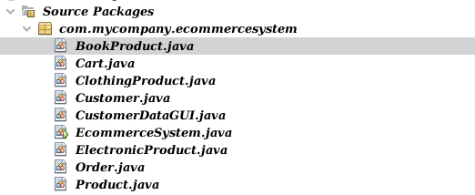

# EcommerceSystem-GUI

## Overview

This project was made for FCDS in 2024 AI Department for Programming || using Jfrane for the GUI , this README shows the full structure of the project, ENJOY!

## Project Documentation

For detailed documentation and screenshots, please refer to the [Project documentation with screenshots.pdf](Project documentation with screenshots.pdf) file.

## Classes

### Product

#### Fields

- `name`: String
- `productId`: int
- `price`: double

#### Constructors

- `Product(int productId, String name, double price)`

#### Methods

- `getName(): String`
- `getPrice(): double`
- `setName(String name): void`
- `setProductId(int productId): void`
- `setPrice(double price): void`

### BookProduct (extends Product)

#### Fields

- `author`: String
- `publisher`: String

#### Constructors

- `BookProduct(String author, String publisher, int productId, String name, double price)`

#### Methods

- `getAuthor(): String`
- `getPublisher(): String`
- `setAuthor(String author): void`
- `setPublisher(String publisher): void`

### ClothingProduct (extends Product)

#### Fields

- `size`: String
- `fabric`: String

#### Constructors

- `ClothingProduct(String size, String fabric, int productId, String name, double price)`

#### Methods

- `getSize(): String`
- `getFabric(): String`
- `setSize(String size): void`
- `setFabric(String fabric): void`

### ElectronicProduct (extends Product)

#### Fields

- `brand`: String
- `warrantyPeriod`: int

#### Constructors

- `ElectronicProduct(String brand, int warrantyPeriod, int productId, String name, double price)`

#### Methods

- `getBrand(): String`
- `getWarrantyPeriod(): int`
- `setBrand(String brand): void`
- `setWarrantyPeriod(int warrantyPeriod): void`

### Customer

#### Fields

- `name`: String
- `address`: String
- `customerId`: int

#### Constructors

- `Customer(String name, String address, int customerId)`

#### Methods

- `getName(): String`
- `getAddress(): String`
- `getCustomerId(): int`
- `setName(String name): void`
- `setAddress(String address): void`
- `setCustomerId(int customerId): void`

### Cart

#### Fields

- `nProducts`: int
- `customerId`: int
- `products`: Product[]

#### Constructors

- `Cart(int nProducts, int customerId)`

#### Methods

- `getNProducts(): int`
- `getCustomerId(): int`
- `getProductsN(): boolean`
- `addProduct(Product product): void`
- `setProducts(Product[] products): void`
- `getProducts(): Product[]`
- `getTotalPrice(): double`
- `removeProduct(Product productToRemove): void`

### Order

#### Fields

- `customerId`: int
- `orderId`: int
- `products`: Product[]
- `totalPrice`: double

#### Constructors

- `Order(int customerId, int orderId, Product[] products, double totalPrice)`

#### Methods

- `getCustomerId(): int`
- `getOrderId(): int`
- `getProducts(): Product[]`
- `getTotalPrice(): double`
- `printOrderInfo(): void`

## Main Class

### EcommerceSystem

This class contains the main method.

#### Methods

- `main(String[] args): void`

